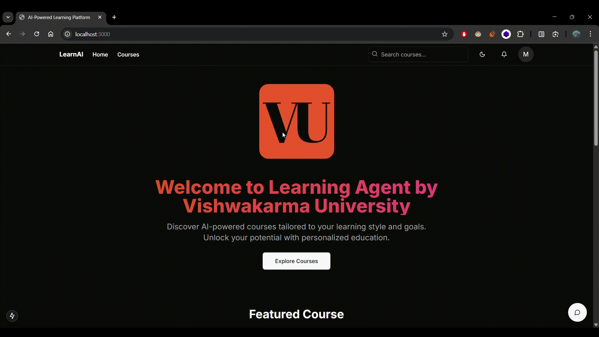
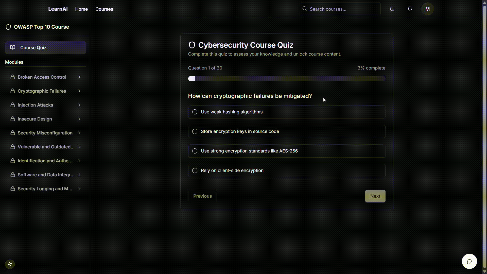
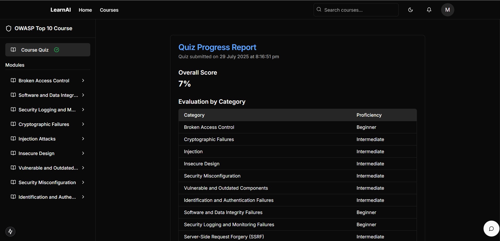

# 🛡️ FullStack AI CyberSecurity Coach

An intelligent cybersecurity learning platform that provides personalized coaching and training using AI-powered assistance and Progress Tracking. This full-stack application helps users learn cybersecurity concepts, practice skills, and get real-time guidance through an interactive and realtime sugesstion based on your expertise in the selected course.

## 🌟 Features

### 🔐 Authentication & User Management

### 📚 Course Management System

### 🧠 AI-Powered Assessment System

### 💬 AI Chatbot Assistant

### 📊 Progress Analytics

### 🎨 Modern User Interface

### 🔧 Technical Features

## 📸 Screenshots & Demo

Showcase of the project in action:

### Homepage





## 🏗️ Tech Stack

### Frontend

- **Framework**: Next.js 15 with App Router
- **React**: React 19
- **Language**: TypeScript
- **Styling**: Tailwind CSS
- **UI Components**: Radix UI + shadcn/ui component library
- **State Management**: React Context API
- **Icons**: Lucide React
- **Themes**: Next.js themes with dark/light mode support

### Backend

- **Runtime**: Node.js with Express.js
- **Database**: MongoDB with Mongoose ODM
- **Authentication**: JWT with secure cookie-based sessions
- **Security**: CORS enabled, cookie-parser middleware
- **API**: RESTful API architecture
- **AI Engine**: Python script integration for quiz evaluation

### Development Tools

- **Package Managers**: npm
- **Environment**: dotenv configuration
- **Development Server**: Nodemon for backend hot-reload
- **Build Tools**: Next.js built-in bundling and optimization

## 📁 Project Structure

```
├── Frontend/                 # Next.js frontend application
│   ├── app/                 # App router pages
│   ├── components/          # Reusable UI components
│   ├── contexts/           # React contexts for state management
│   ├── hooks/              # Custom React hooks
│   ├── lib/                # Utility libraries
│   ├── public/             # Static assets
│   └── styles/             # Global styles
├── Backend/                 # Node.js backend server
│   ├── middlewares/        # Express middlewares
│   │   └── auth.js         # Authentication middleware
│   ├── service/            # Business logic services
│   │   └── auth.js         # Authentication services
│   ├── server.js           # Main server file
│   ├── evaluate.py         # AI evaluation system
│   └── mongoSchema.js      # Database schemas
└── README.md
```

## 🚀 Getting Started

### Prerequisites

- Node.js (v18 or higher)
- npm or yarn
- MongoDB database
- Python (for evaluation system)

### Installation

1. **Clone the repository**

   ```bash
   git clone https://github.com/yourusername/FullStack-AI-CyberSec-Coach.git
   cd FullStack-AI-CyberSec-Coach
   ```

2. **Set up the Backend**

   ```bash
   cd Backend
   npm install
   ```

   Create a `.env` file in the Backend directory with your configuration:

   ```env
   MONGODB_URI=your_mongodb_connection_string
   JWT_SECRET=your_jwt_secret
   PORT=5000
   ```

3. **Set up the Frontend**

   ```bash
   cd Frontend
   npm install --legacy-peer-deps
   ```

   Create a `.env.local` file in the Frontend directory:

   ```env
   NEXT_PUBLIC_API_URL=http://localhost:5000
   ```

### Running the Application

1. **Start the Backend Server**

   ```bash
   cd Backend
   npm install
   npm run dev
   ```

   The backend will run on `http://localhost:5000`

2. **Start the Frontend Development Server**
   ```bash
   cd Frontend
   npm install --legacy-peer-deps
   npm run dev
   ```
   The frontend will run on `http://localhost:3000`

## 🔧 Configuration

### Environment Variables

#### Backend (.env)

- `MONGODB_URI` - MongoDB connection string
- `JWT_SECRET` - Secret key for JWT token generation
- `PORT` - Server port (default: 5000)

#### Frontend (.env.local)

- `NEXT_PUBLIC_API_URL` - Backend API URL

## 🎯 What Makes This Project Unique

### OWASP Top 10 Focus

- Comprehensive coverage of the OWASP Top 10 security vulnerabilities
- 30 carefully crafted questions covering all major security categories
- Industry-standard cybersecurity knowledge assessment

### Intelligent Evaluation System

- Python-based AI evaluation engine that analyzes user responses
- Skill level classification across 10 OWASP categories
- Personalized learning recommendations based on knowledge gaps

### Modern Full-Stack Architecture

- Clean separation between frontend (Next.js) and backend (Express.js)
- Secure authentication with JWT tokens and HTTP-only cookies
- MongoDB integration for scalable data management
- Real-time progress tracking and analytics

### Educational Impact

- Developed by students from Vishwakarma University
- Focuses on making cybersecurity education accessible
- Interactive learning approach with immediate feedback

## 🤝 Contributing

1. Fork the repository
2. Create your feature branch (`git checkout -b feature/AmazingFeature`)
3. Commit your changes (`git commit -m 'Add some AmazingFeature'`)
4. Push to the branch (`git push origin feature/AmazingFeature`)
5. Open a Pull Request

## 👥 Collaborators

Special thanks to the following collaborators for their contributions:

- [@o-Erebus](https://github.com/o-Erebus)
- [@ShrE333](https://github.com/ShrE333)

---

⭐ **Star this repository if you find it helpful!** ⭐
